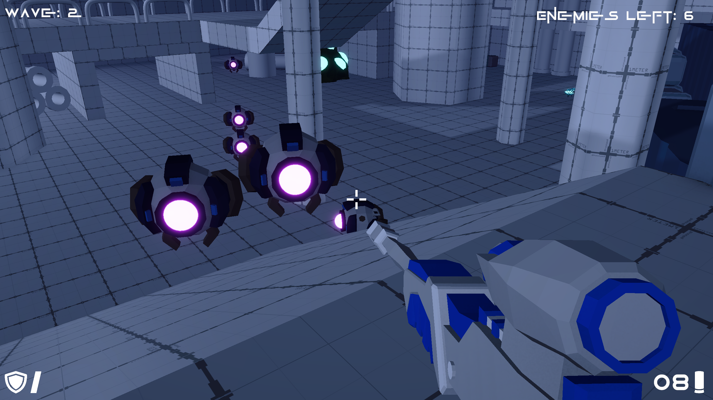

# Killzone Zero

**「Killzone Zero」** は、次々と襲いかかる敵ウェーブを生き残ることを目的とした
FPSサバイバルゲームです。
敵の攻撃を避け、武器とライフを管理しながら、最後のウェーブまで生存できれば勝利です。

## ■ 使用エンジン

Unity **6000.0.032f1**

---

## ■ ゲームの目的

* 複数のウェーブすべてを生き残れば勝利
* 死亡すると **ライフが1つ減少**し、別のスポーン地点へリスポーン
* マップに落ちている **3種類の銃（ピストル / マシンガン / スナイパー）** を拾って戦う
* 弾薬箱を拾って弾薬を補充
* **ライフが0になるとゲームオーバー**

---

## ■ 武器 & アイテム

### ● 武器

* **ピストル**：初期装備
* **マシンガン**：高速連射タイプ
* **スナイパー**：Ctrl でスコープ使用可能。遠距離に強い

### ● アイテム

* **弾薬箱**：装備中の武器の弾薬を補充

---

## ■ 操作方法

| 操作        | キー                 |
| --------- | ------------------ |
| 移動        | WASD               |
| ジャンプ      | Space              |
| 射撃        | マウス左クリック           |
| 視点操作      | マウス                |
| スナイパースコープ | Ctrlキー長押し（スナイパーのみ） |

## ■ クレジット

* 音楽：Music by <a href="https://pixabay.com/users/kaazoom-448850/?utm_source=link-attribution&utm_medium=referral&utm_campaign=music&utm_content=414774">Paul Winter</a> from <a href="https://pixabay.com//?utm_source=link-attribution&utm_medium=referral&utm_campaign=music&utm_content=414774">Pixabay</a>
* SFX：Sound Effect by <a href="https://pixabay.com/users/soundreality-31074404/?utm_source=link-attribution&utm_medium=referral&utm_campaign=music&utm_content=312659">Jurij</a> from <a href="https://pixabay.com/sound-effects//?utm_source=link-attribution&utm_medium=referral&utm_campaign=music&utm_content=312659">Pixabay</a>